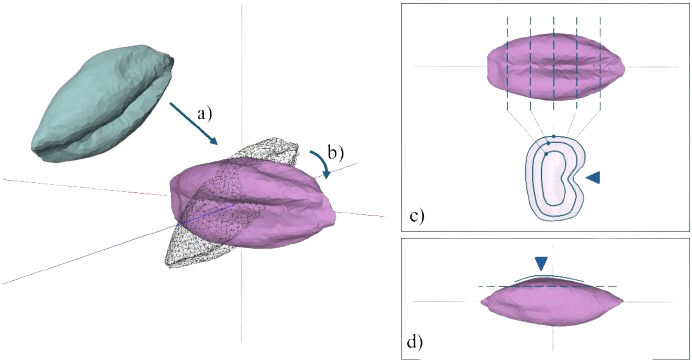

# TFG - Análisis morfométrico y clasificación de granos de cebada mediante armónicos esféricos y deep learning

## Resumen del proyecto

En este trabajo se explora el análisis morfométrico aplicado a granos de cebada con la ayuda de una representación en armónicos esféricos y su posible uso en experimentos de clasificación. Es una pequeña parte de un proyecto de investigación llevado a cabo por parte del [ICAC](www.icac.cat), el Instituto Catalán de Arqueología Clásica, con la colaboración del [Centro de Visión por Computador](https://www.cvc.uab.es/) de la Universitat Autònoma de Barcelona, proyecto en el que he colaborado desarrollando el código y los resultados que se encuentran en este repositorio.

## Guia del repositorio

La carpeta [src](https://github.com/jaesmoris/TFG/tree/main/src) contiene el código desarrollado durante el proyecto. Principlamente se encuentran los scripts de entrenamiento o visualización de datos.

En [src/utils](https://github.com/jaesmoris/TFG/tree/main/src/utils) están las funciones más relevantes para el alineamiento, descomposición y recomposición de granos.

En [src/laboratory](https://github.com/jaesmoris/TFG/tree/main/src/laboratory) se encuentran algunas pruebas realizadas o scripts puntuales.

En [models](https://github.com/jaesmoris/TFG/tree/main/models) se han guardado los modelos entrenados a lo largo de este proyecto.

En [logs](https://github.com/jaesmoris/TFG/tree/main/logs) se han registrado el transcurso del entrenamiento de modelos así como su evaluación.

En [Notebooks](https://github.com/jaesmoris/TFG/tree/main/Notebooks) contiene tres jupyter notebooks con la mayor parte del código de [src](https://github.com/jaesmoris/TFG/tree/main/src) detallando cómo usarlo. El primer notebook trata el alineamento de granos, el segundo la descomposicion y recomposición de granos usando armónicos esféricos y, finalmente, el tercero el entrenamiento y evaluación de modelos.

## Imágenes

Aquí se muestran algunas imágenes para ilustrar el proyecto.

##### Dataset y alineamiento

Proceso de alineación del dataset.

##### Armónicos esféricos

Figuras de algunos armónicos esféricos. Los granos se han representado como combinación lineal de estas formas.

##### Descomposición SH

Representaciones de un grano truncando la descomposicion SH en distintos límites.

